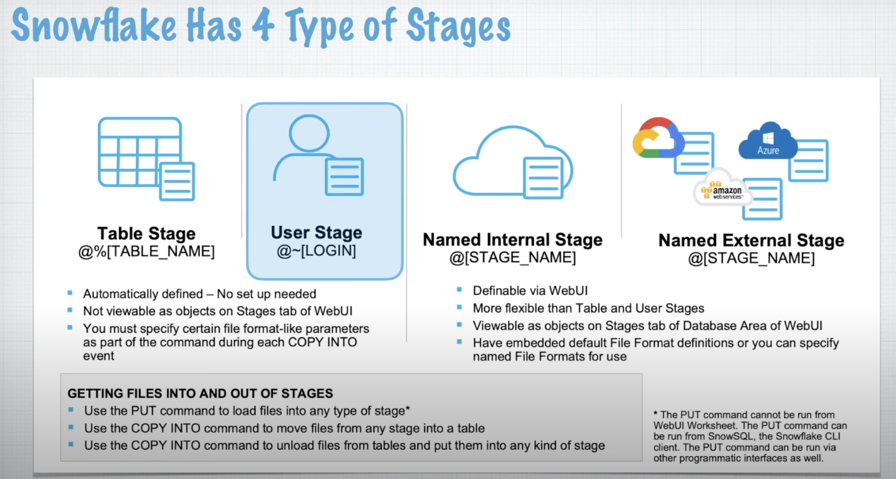

# Includes following:
- User Stage
- Table Stages 
- Internal Stages
- Query Stages (Semi structured data)
- File Format & Copy command
- Copy Command options - pattern and file validation
- Copy Command Performance - Compression & Warehouse Size

- 