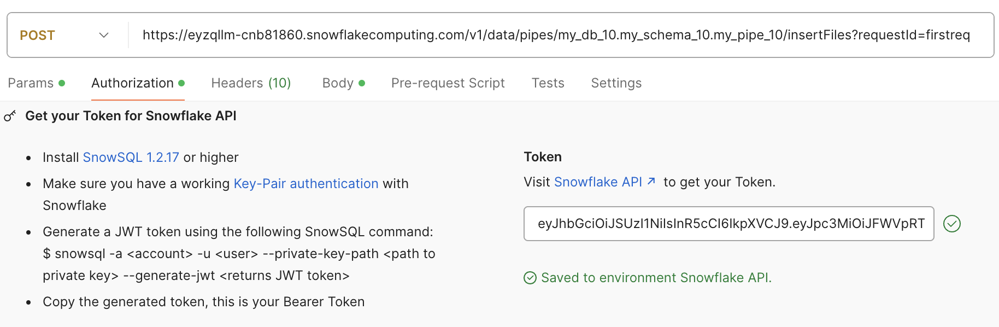
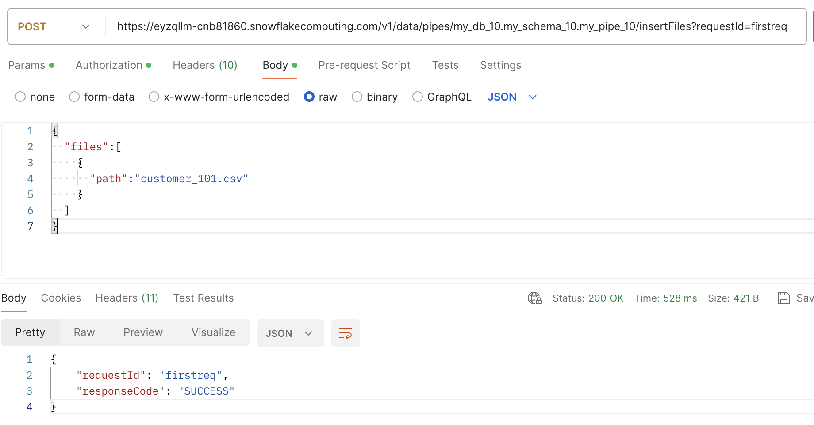

Create RSA Key Pair using following steps:
https://docs.snowflake.com/en/user-guide/key-pair-auth#configuring-key-pair-authentication

After putting the file in the stage location, send POST request for queing the file for ingestion. File name matters a lot. 
It should be the remaining path following the one given while creating the pipe.

- `url`: `https://<accountname>.snowflakecomputing.com/v1/data/pipes/my_db_10.my_schema_10.my_pipe_10/insertFiles?requestId=firstreq`
- `Authorization`: bearer token

    

- `Content-Type`: `application/json`
- `body`: 

API reference: https://docs.snowflake.com/en/user-guide/data-load-snowpipe-rest-apis#load-history-reports